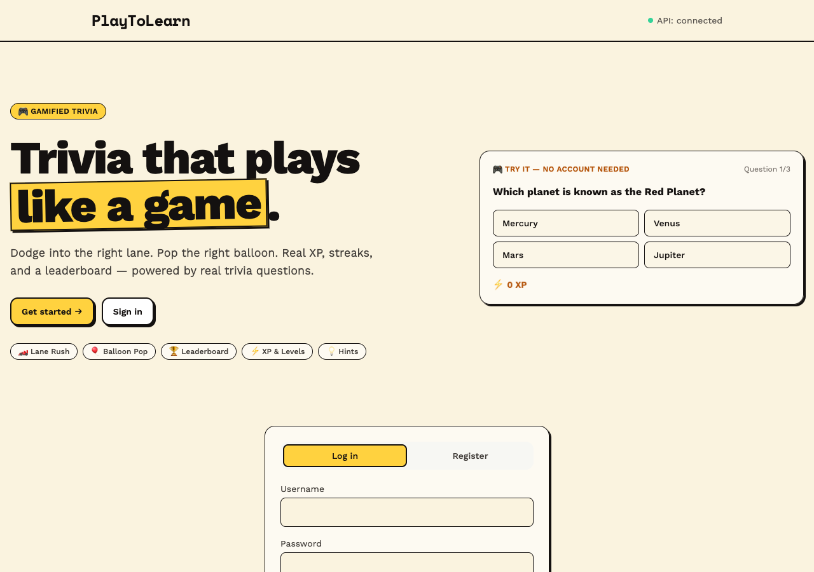
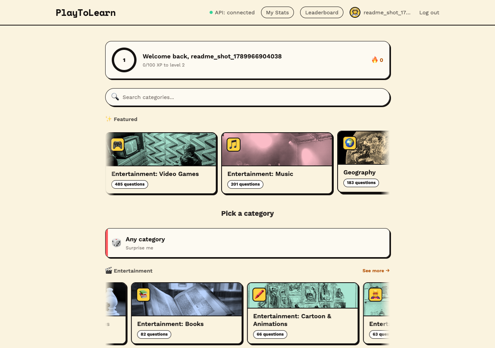
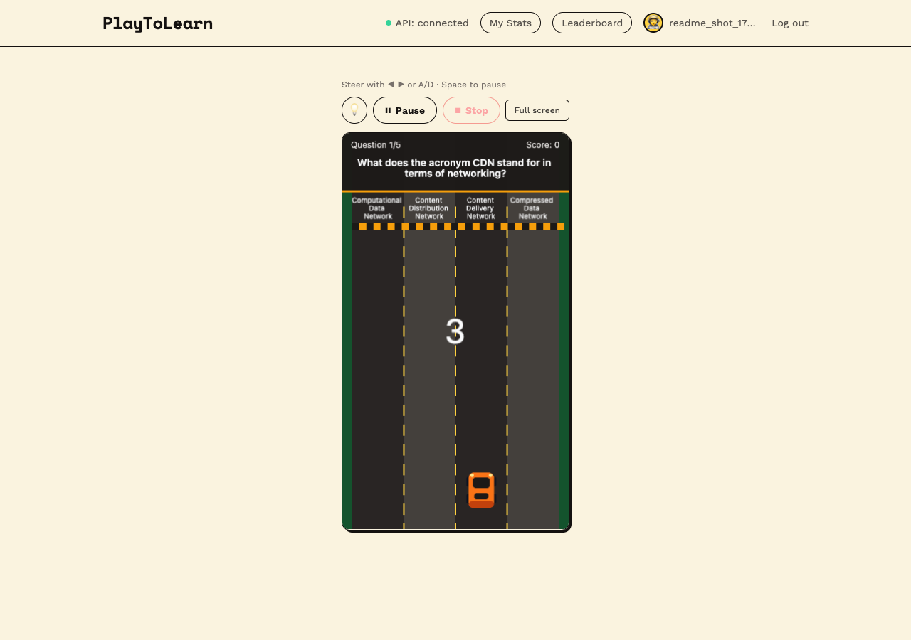
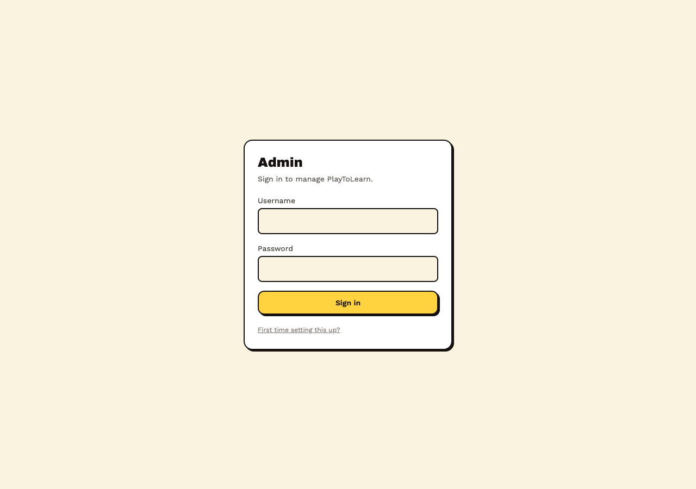

# PlayToLearn


**Live:** [playtolearn-five.vercel.app](https://playtolearn-five.vercel.app)

A full-stack gamified trivia platform. Questions are answered through short
interactive browser games (a lane-dodging runner, a balloon-popping game) instead
of a plain multiple-choice form, backed by a real quiz engine, auth, XP/leaderboard
system, a moderation/admin layer, and a live production deployment.

## Demo

<video src="https://github.com/neerajkattal/microlearning-platform/raw/main/docs/demo/playtolearn-demo.mp4" controls muted poster="https://github.com/neerajkattal/microlearning-platform/raw/main/docs/demo/playtolearn-demo.jpg" width="100%"></video>

<!-- GitHub renders the <video> tag above inline on github.com. If a viewer's
     client doesn't render raw <video> tags, the screenshots below are the
     same real UI, captured from the live site. -->

| | |
|---|---|
|  |  |
| Landing — try a real question with no account | Category browser, grouped and searchable |
|  |  |
| Lane Rush — an actual QuizAPI.io question in play | Admin dashboard — separate login, own JWT |

**Stack:** FastAPI (Python) · PostgreSQL · Redis · SQLAlchemy/Alembic · React +
TypeScript · Phaser (game engine) · Docker Compose · deployed on Vercel + Render +
Upstash.

## Highlights

- **Server-authoritative scoring** — the client never sees which answer is correct
  until after it submits; answer order is shuffled per session.
- **Two Phaser game modes** sharing one quiz engine, each split into a pure,
  fully-unit-tested game-logic module plus a thin rendering layer.
- **Real auth, XP, streaks, achievements, and a leaderboard** — JWT + bcrypt,
  server-computed scoring formula (base + difficulty + speed + streak bonuses),
  with a live-editable scoring config (no redeploy needed to retune it).
- **Two independent question sources** (OpenTDB, QuizAPI.io) behind one
  `QuestionProvider` abstraction — adding a source means writing one adapter, the
  fetch/normalize/dedupe/persist pipeline doesn't change. Ingestion runs on a
  schedule via GitHub Actions (Render's free tier has no background-worker plan),
  gated by a shared operator key so it can't be triggered by anyone with the URL.
- **A real admin dashboard** (`/admin`, separate login from player accounts) —
  live stats, user search/rename/hide-from-leaderboard, category/question CRUD
  with soft-deactivate instead of destructive deletes, an activity feed, and a
  topic-request inbox (players can ask for a category that doesn't exist yet;
  admins see a live pending-count badge).
- **Username moderation** — a banned-word filter at registration, plus the admin
  tools above for whatever slips past it.
- **Production hardening**: structured JSON logging with request IDs, Redis rate
  limiting on auth endpoints, Redis caching on hot read endpoints, a documented
  self-review that found and fixed a real bug (the rate limiter was keying off the
  reverse proxy's IP instead of the real client's).
- **377 automated tests** (143 API, 17 worker, 217 frontend) across unit,
  integration, and component-level coverage.
- **Live deployment** — Vercel (frontend) + Render (API, Docker) + Upstash (Redis),
  with a free-tier-aware architecture (GitHub Actions cron jobs replace a paid
  background worker and keep the API warm to avoid cold starts).

See `ENGINEERING.md` for the full engineering constitution, and `docs/START_HERE.md` for
the product/architecture overview.

## Status

Phases 0-7 of the build plan complete (foundation, question ingestion, quiz engine,
two game modes, auth/gamification, production hardening), plus a full UI/UX
redesign, a live deployment, and a post-launch round of real production features:
a second question source, an admin dashboard, username moderation, and a
topic-request pipeline. See `docs/BUILD_PLAN.md` for the phased roadmap and
`docs/architecture/` for what each phase actually delivered.

## Local setup

Requires Docker, Docker Compose, Node 20+, and Python 3.12 (the last two only for
running things outside Docker — tests, Alembic).

```bash
cp .env.example .env

# Full stack (postgres, redis, api, worker, web, nginx)
make up
# → open http://localhost:8080

# Once postgres is up (via `make up` in another terminal, or `docker compose up postgres`):
make migrate
```

### Running tests / checks without Docker

Each service has its own virtualenv/node_modules; see each service's directory if
you need to set one up from scratch.

```bash
make test        # api + worker + web, all of it
make test-api
make test-worker
make test-web
make typecheck    # shared-types + game-contracts
make build        # production build of apps/web
```

### Ports

| Service | Port | Notes |
|---|---|---|
| nginx | 8080 | single entry point — use this one |
| web (Vite) | 5173 | direct, bypasses nginx |
| api (FastAPI) | 8000 | direct; `/docs` for interactive API explorer |
| postgres | 5432 | exposed for `make migrate` / local psql |

## Admin dashboard

A separate surface at `/admin`, with its own login — completely independent of
player accounts (different table, different JWT, a player's token is rejected by
every `/admin/*` route and vice versa).

First-time setup: open `/admin`, click **"First time setting this up?"**, and use
the `ADMIN_API_KEY` env var as the one-time key (it only gates account creation —
after that you log in with a normal username/password, and the key is never
needed again). That endpoint permanently disables itself once one admin account
exists, so this only works once.

## Docs

- `docs/START_HERE.md` — project overview
- `docs/BUILD_PLAN.md` — phased implementation roadmap
- `docs/architecture/PHASE_0.md` — what Phase 0 actually delivered, known gaps
- `docs/architecture/QUESTION_SYSTEM.md` — Q&A architecture
- `docs/decisions/` — architecture decision records
- `docs/DEFINITION_OF_DONE.md` — delivery quality gate
- `docs/operations/DEPLOYMENT.md` — how the live deployment actually works (Vercel/Render/Upstash, real gaps found and fixed along the way)
- `docs/learning/` — infrastructure learning notes (gitignored, personal)
